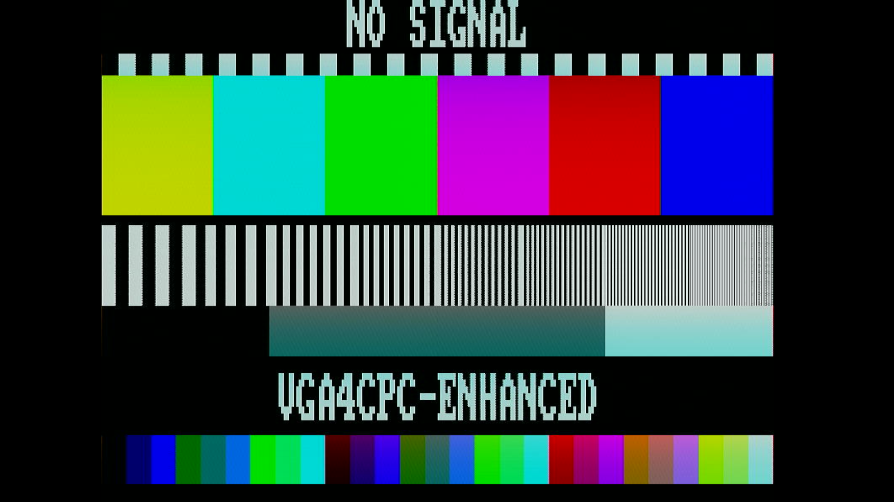

# VGA4CPC-Enhanced

A direct **Amstrad CPC → VGA scan-doubler** firmware for the
[grzegorz-gr/vga4cpc](https://github.com/grzegorz-gr/vga4cpc) PCB
(Raspberry Pi Pico based).

Captures the live CPC RGB+CSYNC signal at 16 MHz, line-doubles it, and
emits a clean **576p50** or **800×600p60** VGA signal — no jitter, no
dropped lines, full-resolution including borders/overscan.

This is a from-scratch reimplementation of the capture and output
pipeline using custom PIO programs on both PIO blocks. The VGA-output
PIO programs (`hsync_50/60`, `vsync_50/60`, `rgb_50/60`) and the
capture PIOs (`rgbin`, `vsyncgen`) are ported directly from the
upstream grzegorz-gr/vga4cpc firmware — full credit to **gregg** for
the original timings and PIO designs.

---

## Screenshots

> *Captured via: CPC → VGA4CPC PCB (running this firmware) → VGA-to-HDMI
> converter → USB-HDMI capture dongle → PC. Some softness and chroma
> fringing visible in the captures is from the capture chain itself, not
> the scan-doubler output — on a VGA monitor connected directly to the
> PCB the image is appreciably sharper.*

CPC BASIC 1.1 prompt on an Amstrad 6128 — the two display modes side by
side (both ship in the same firmware; press **BOOTSEL** at runtime to
toggle between them):

| Normal mode | Scanlines mode |
|:---:|:---:|
|  |  |

Running real CPC software — Batman intro logo and a mode-0 cutscene
illustrating the full colour range and borders the scan-doubler
preserves:

| | |
|:---:|:---:|
|  |  |

### Videos

Click through to YouTube for live captures of the firmware running:

| Normal mode + "no signal" hand-off | Scanlines mode |
|:---:|:---:|
| [](https://www.youtube.com/watch?v=u6UePIkd_Jg) | [](https://www.youtube.com/watch?v=mkgNcqdlhVY) |

A longer, more demanding test — [**SymbOS**](https://www.symbos.de/) running
jitter-free, with the BOOTSEL scanlines toggle shown switching modes on
the fly:

[](https://www.youtube.com/watch?v=wtBRFJdr2-E)

---

## Hardware

- Raspberry Pi Pico (RP2040)
- grzegorz-gr/vga4cpc PCB (TLV3202 dual comparators + 6-bit R-2R DAC)
- 50/60 Hz slide switch on GPIO 26
- LED on GPIO 25 (status / diagnostic)

### Pin map

| GPIO  | Function                                  |
|-------|-------------------------------------------|
| 0–5   | CPC RGB input (B_LO, B_HI, G_LO, G_HI, R_LO, R_HI) |
| 6     | CSYNC input (active low)                  |
| 10    | vsyncgen output (PCB internally routes this to GPIO 7) |
| 12    | VGA HSYNC                                 |
| 13    | VGA VSYNC                                 |
| 14–19 | 6-bit R-2R DAC (R/G/B × 2 bits each)      |
| 25    | LED                                       |
| 26    | 50/60 Hz mode switch (closed/LOW = 50 Hz) |

> **Note: GPIO 10 → GPIO 7 is hardwired on the PCB.**
> The capture path generates a clean VSYNC signal in software (PIO1
> SM0 derives it from the noisy composite CSYNC) and drives it out on
> GPIO 10. The rgbin SM then reads that VSYNC back via GPIO 7. The
> VGA4CPC PCB already connects these two pins internally — **nothing
> for the user to wire up**. This is just a heads-up if you're
> repurposing the firmware on a different board, where you'd need to
> create that connection yourself.

---

## Flash & use

**Most users want this section, not the Build section below.** A
single prebuilt firmware image is committed to [`dist/`](dist/):

- [`dist/vga4cpc_enhanced.uf2`](dist/vga4cpc_enhanced.uf2)

1. Hold BOOTSEL while plugging the Pico into USB, then drop the
   `.uf2` file from `dist/` onto the `RPI-RP2` drive.
2. Plug the VGA cable into your monitor.
3. Connect the CPC's RGB cable to the PCB.
4. Pick the output mode with the slide switch on GPIO 26:
   - **closed / LOW** → 576p50 (CEA-861, ~50.08 Hz, scaled to ~800px wide)
   - **open / HIGH**  → 800×600p60 (DMT)

### Scanlines toggle (BOOTSEL button)

Once the firmware is running, **press the BOOTSEL button** on the Pico
to toggle the CRT-style scanlines effect on or off. Each press flips
the mode; button must be released before the next press counts.

The selected mode is **persisted to the last 4 KB sector of the Pico's
flash**, so it survives power cycles — set your preference once and
the firmware will boot into the same mode next time. First-ever boot
(blank persistence sector) defaults to **scanlines off**.

The on-board LED (GPIO 25, PWM-dimmed to ~half brightness) indicates
sync state:
- **Solid (dim)** → CPC sync detected, frames being captured.
- **Flashing at ~1 Hz** → waiting for sync (no CPC connected, CPC
  powered off, or signal loss).

### "No signal" test pattern



When no CPC signal is present, the firmware paints a "NO SIGNAL /
VGA4CPC-ENHANCED" test card into the framebuffer so the monitor
isn't left showing a frozen last-frame or a blank screen.

- **At boot**, the card appears immediately. As soon as the CPC starts
  sending video, capture overwrites the card line-by-line and live CPC
  content takes over within one frame (~20 ms).
- **When the CPC is powered off**, the firmware notices the loss of
  HSYNC pulses within ~200 ms, then waits a further **3 seconds** of
  total silence before painting the card. This guard against brief
  hiccups (cable wobble, manual reset, etc.) avoids spurious flashes
  to the "no signal" screen.
- **When the CPC comes back**, live video resumes automatically inside
  one frame — no key press, no reboot required.

The card itself shows a "NO SIGNAL" banner, a castellation row, six
full-bright colour bars (Y/C/G/M/R/B), a frequency burst pattern, a
4-step greyscale ramp, a "VGA4CPC-ENHANCED" banner, and a 27-cell
strip showing every native CPC colour (3³ combinations of the three
per-channel voltage levels). All drawn procedurally; no embedded
image asset. Text is rendered in a verbatim copy of the CPC6128 OS
ROM character set.

---

## Build

Only needed if you want to modify the firmware. Prebuilt UF2s are in
[`dist/`](dist/) — see *Flash & use* above.

Requirements:
- **Raspberry Pi Pico SDK v1.5.1** — install from
  [the official Pico setup guide](https://github.com/raspberrypi/pico-sdk#quick-start-your-own-project).
  The Windows installer bundles everything; on Linux/macOS you'll set
  `PICO_SDK_PATH` to point at your checkout.
- **CMake**, **Ninja**, and **arm-none-eabi-gcc** (all included in the
  Windows Pico installer; install separately on Linux/macOS via your
  package manager).

### Windows one-click

```cmd
build.cmd
```

Builds the single firmware into `dist\vga4cpc_enhanced.uf2`.

The script assumes the default Windows SDK path
(`C:\Program Files\Raspberry Pi\Pico SDK v1.5.1`). Edit the `SDK`
variable at the top of `build.cmd` if yours lives elsewhere.

### Manual (any platform)

```sh
mkdir build && cd build
cmake -G Ninja -DPICO_SDK_PATH=/path/to/pico-sdk ..
ninja
```

`PICO_SDK_PATH` can also be set as an environment variable in your
shell so you don't need to repeat it. The `CMakeLists.txt` default
points at the Windows install location, so passing `-DPICO_SDK_PATH`
explicitly is recommended on Linux/macOS.

Scanlines are a **runtime** option now — there's no compile flag for
them. The single UF2 contains both normal and scanlines modes; the
user toggles at runtime via the BOOTSEL button.

---

## Architecture

```
   CPC                Pico (128 MHz)                VGA
   ───                ──────────────                ───

  RGB ──► GPIO 0-5 ──► PIO1 SM1 (rgbin) ──┐
  CSYNC ► GPIO 6  ──► PIO1 SM0 (vsyncgen)─┤
                                          │
                              Core 0 polling loop
                                          │
                              ┌───── DMA (per line) ──► framebuf[288][800]
                              │
                              └───── 4-channel DMA ring (line-doubled,
                                     each fb line streamed twice)
                                          │
                                          ▼
                              PIO0 SM2 (rgb) ──► GPIO 14-19 ──► 6-bit DAC
                              PIO0 SM0 (hsync) ► GPIO 12     ─┐
                              PIO0 SM1 (vsync) ► GPIO 13     ─┘
```

- **`sys_clock` = 128 MHz** — chosen so 128 ÷ 8 = 16 MHz exact CPC
  capture clock, matching the CPC pixel rate.
- **PIO1** runs the capture side: `vsyncgen` discriminates CSYNC into a
  VSYNC level on GPIO 10 (wired back to GPIO 7 on the PCB);
  `rgbin` is a per-line, HSYNC-aligned sampler that pushes one
  byte per pixel to its RX FIFO.
- **Core 0** owns the capture loop forever: busy-polls CSYNC and
  VSYNC, fires a fresh DMA per CPC line straight from the RX FIFO
  into a framebuffer row.
- **PIO0** runs the VGA output side: three SMs cooperating via PIO
  IRQs to produce HSYNC/VSYNC/RGB.
- **4-channel DMA chain** produces line-doubled output by streaming
  each framebuffer row to the RGB SM's TX FIFO twice in a row — so
  288 captured CPC lines drive 576 VGA output lines, scan-doubling to
  576p without any extra capture or memory cost. (Each CPC line is
  still captured only once; the duplication happens entirely on the
  output side, via the DMA's source-pointer table listing each row
  pointer twice.)

### Pixel byte layout

CPC's 6-bit thermometer-coded RGB comes out of the comparators in the
exact bit order the on-board DAC wants:

```
  bit 5 4 3 2 1 0
       R R G G B B
```

So the capture DMA writes raw 6-bit samples into the framebuffer, and
the output DMA streams those same bytes to the DAC pins. **No palette
lookup is needed.** The CPC's three native voltage levels per channel
map to DAC values 0, 1, and 3 — level 2 (half-bright) is unused by the
CPC but available to firmware-generated content (e.g. the boot test
pattern uses it for the white bar).

### Horizontal sizing

The CPC produces ~800 active pixels per line at 16 MHz (full visible
including borders). The `rgb_50` PIO sends 800 pixels into a 720-pixel
576p50 timing window — i.e. it overscans by ~11%, which makes the full
CPC display (borders included) fit a typical VGA monitor's visible
area. Monitors still detect a standard 720×576p50 signal.

### Display modes

A single firmware UF2 ships both display modes; the user toggles between
them at runtime via the BOOTSEL button (see *Flash & use* above):

| Mode             | Description                                   |
|------------------|-----------------------------------------------|
| Normal (default) | Plain colour scan-doubled output              |
| Scanlines        | CRT-style dark gap between every pair of lines|

The scanlines effect is implemented by flipping the odd-indexed entries
of the output-DMA's source-pointer ring between the framebuffer rows
and a single all-black row. Toggling has no measurable effect on
capture / output performance — each `line_src[]` slot is a single
32-bit pointer, written atomically from the capture loop's per-frame
BOOTSEL check.

Earlier development versions experimented with monochrome / amber /
green "P1/P3 phosphor" effects, but they were abandoned because the
LUT pass through the framebuffer couldn't keep up with the per-line
capture deadline at 128 MHz.

---

## Known limitations

### Soft colour fringing at sharp colour transitions

If you zoom in on the captured image — particularly at white text on a
coloured background in mode 2 — you'll see a faint coloured halo (2–4
pixels wide) around glyph edges, and the background close to text is
not perfectly uniform.

This is a property of the **analog signal path on the PCB**, not the
firmware. The CPC's gate-array RGB output has nonzero rise/fall times
and some post-transition ringing; the TLV3202 comparators on the
VGA4CPC PCB digitise whatever they see at the sample instant,
including those in-flight values. Because the Pico's capture clock and
the CPC's pixel clock aren't phase-locked to each other, the *exact*
wrong value caught at each transition drifts slightly between frames
— producing a subtle shimmer as well.

Side-by-side testing confirms this firmware shows **noticeably less
fringing than the upstream grzegorz-gr/vga4cpc firmware** on the same
PCB, so what's here is essentially the best the unbuffered
comparator and R-2R DAC path can deliver on the original Pico
(RP2040). On a solid
colour field (e.g. `CLS`) there are no artefacts at all — the issue is
strictly transition-related.

> *Note: the fringing is **substantially more pronounced through a
> VGA-to-HDMI converter + USB capture dongle** (as in the screenshots
> above) than on a VGA monitor connected directly to the PCB. Capture
> chains apply chroma subsampling that smears colour transitions, so
> what you see in the screenshots overstates the artefact. Live, on a
> CRT or LCD VGA monitor, it's hard to spot from a normal viewing
> distance.*

---

## Pico 2 roadmap

The PCB is pin-compatible with the **Raspberry Pi Pico 2 (RP2350)**,
which would enable meaningful improvements:

| Pico 2 resource          | What we'd use it for                                |
|--------------------------|-----------------------------------------------------|
| 520 KB SRAM (vs 264 KB)  | True double-buffered framebuffer — eliminates any output-side tearing race and unlocks safe post-capture filtering on Core 1 |
| Up to ~200 MHz core clock | 12 cycles per CPC pixel @ 192 MHz; could sample twice per pixel with majority voting to reject in-flight comparator values |
| 3rd PIO block (12 SMs)   | Dedicated CSYNC-tracking / clock-recovery SM to phase-lock our sample clock to the CPC's pixel clock |
| Cortex-M33 @ 150 MHz     | Headroom for inline filtering / decoding on either core |

Most importantly, the **frame-to-frame shimmer** (from the unlocked
sample clock) and the **dual-read output race** (from single-buffered
output) would both be solvable. The residual *analog* fringing from
the comparators themselves would remain unless paired with a PCB-level
mod (RC filter on comparator inputs, buffer chip on the DAC outputs,
or shorter CPC cable).

No Pico 2 port work has started — this section is here so anyone
picking up the project knows where the real headroom is.

---

## Credits

- **gregg** (grzegorz-gr) — original [`vga4cpc`](https://github.com/grzegorz-gr/vga4cpc) PCB design and the
  PIO programs this firmware is built on. The `hsync_*.pio`,
  `vsync_*.pio`, `rgb_*.pio`, `rgbin.pio` and `vsyncgen.pio` programs
  are taken from that project, with only minor refactoring.
- **Hunter Adams** — the original VGA-from-PIO timing approach the
  upstream firmware credits as its basis.
- **All C code, build scripts, and documentation in this repository
  were written by [Claude Code](https://claude.com/claude-code)
  (Anthropic) under direction from the project owner.**

---

## License

Released into the **public domain** under [The Unlicense](LICENSE).
Do whatever you want with it — no warranty.

The PIO programs in `src/` are adapted from the upstream
[grzegorz-gr/vga4cpc](https://github.com/grzegorz-gr/vga4cpc) project
(which itself has no stated license); the adaptations here are also
public-domain.
